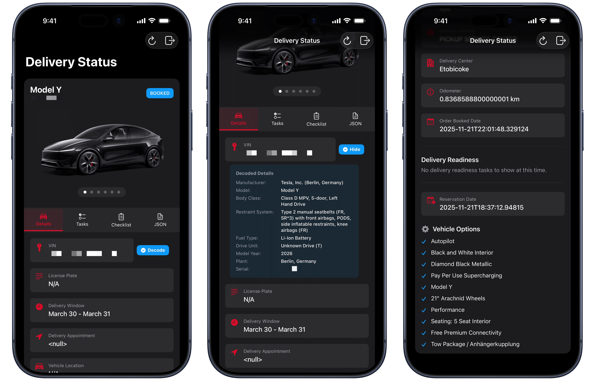

# Testatus



An iOS application built with SwiftUI to track your Tesla delivery status, vehicle options, and decoded VIN details. Provides a clean and interactive dashboard to parse and view Tesla's undocumented delivery API payload perfectly rendered on iPhone and iPad.

## 🌟 Inspiration

This project was heavily inspired by the amazing [tesla-delivery-status-web](https://github.com/GewoonJaap/tesla-delivery-status-web) by [GewoonJaap](https://github.com/GewoonJaap). Massive thanks to him for figuring out the undocumented Tesla API endpoints and providing a solid foundation to build upon!

## ✨ Features

- **Secure Login**: Securely log in using Tesla's OAuth to fetch your live delivery orders.
- **Intelligent VIN Decoder**: Translates the 17-character VIN assigned to your order into human-readable manufacturer, model, plant, and drivetrain information.
- **Live Vehicle Options Map**: Converts the raw Tesla `mktOptions` strings (e.g., `WHITE`, `W40B`, `APBS`) into the actual marketing names of your configuration.
- **Dynamic Odometer Units**: Intelligently determines whether to display your delivery odometer limit in Miles or Kilometers based on your delivery region code (`REEU`, `COCA`, `COUS`, etc.) or your raw JSON `vehicleOdometerType` API payload.
- **Universal App**: Beautifully adapts to both iOS and iPadOS multitasking environments with custom-generated Icons.
- **Developer Friendly**: Uses `XcodeGen` to prevent `.xcodeproj` merge conflicts.

## 🛠 Prerequisites

- iOS 16.0+
- Xcode 14.0+
- Swift 5.7+
- [XcodeGen](https://github.com/yonaskolb/XcodeGen) (Required to generate the Xcode project)

## 🚀 Getting Started

Since this project uses `XcodeGen`, the `.xcodeproj` file is intentionally excluded from the repository. You will have to generate it before opening Xcode.

1. **Clone the repository:**
   ```bash
   git clone https://github.com/alixrezax/Testatus.git
   cd Testatus
   ```

2. **Generate the Xcode Project using XcodeGen:**
   If you don't have XcodeGen installed, you can install it via Homebrew:
   ```bash
   brew install xcodegen
   ```
   
   Once installed, run:
   ```bash
   xcodegen generate
   ```

3. **Open the Project:**
   ```bash
   open Testatus.xcodeproj
   ```

4. **Create Your Configuration File:**
   Because this is a public repository, the `project.yml` file has been intentionally excluded to keep Developer Teams private. Before building onto your physical device, duplicate the provided template file:

   ```bash
   cp project.example.yml project.yml
   ```

   Then open the newly created `project.yml` file.
   
   Replace `com.yourdomain` with your reverse domain and `YOUR_10_CHAR_TEAM_ID` with your Apple Developer Team ID.

5. **Apply Configuration:**
   Run `xcodegen generate` again to apply your new configuration and signing identity.

## 🤝 Roadmap / Contributions

Feel free to fork this project and submit pull requests. Due to the undocumented nature of Tesla APIs, any payloads with unknown option codes that you discover are welcome as PRs to the `TeslaOptionCodes.swift` dictionary.
